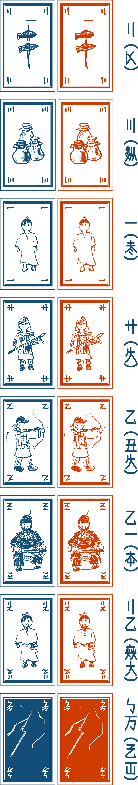
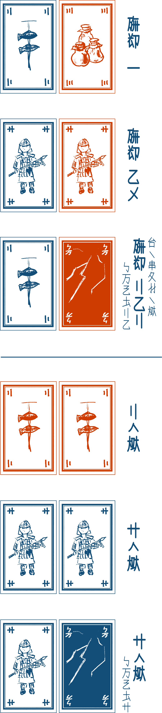
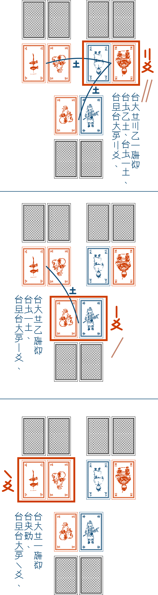

{height=100%}

人如大遠小周之賢人助王。使手片為生大遠加小周之二集。大遠加大遠。小周加小周互戦。遊術終之時全豊之人上行。

# 箱内

- **遊律** 一  
- **紙片** 三十二 (赤青。毎二片。七位加歪片) 閉即皇色連輪。開即人物豊在。

{height=100%}

- **遊終積銭筆付片** 二 (使於二人加三人。四人加五人)
- **光龍卵** 一  
- **賢人手巻** 十二  
- **値軸** 三十五  
- **紙銭** 五十 (一銭十片。二銭十五片。五銭十五片。十銭十片)

{height=100%}

# 遊術行術

## 遊術終時

一亦多人在手下銭之時遊術須終。

- **二人** 三銭  
- **三人** 十五銭  
- **四人** 二十銭  
- **五人** 三十銭

## 始時

混々全片為生積片。全人**手五**片而此手片。

## 裁集

使手片為生**二集**。於**一集二片**在。**硬集大遠**。**軟集小周**。同硬此善。残片於下季力使。全人手二集而於机須閉付。

{height=100%}

**集之硬軟**如此。集**「友」**加**「汪磨」**在。友同色同値之二片。友於全汪磨硬力。此故於友心之糸連在。友加友之硬軟目積値之大小定。汪磨此無友之集。汪磨之硬軟目積値之大小定。

**神声此同色歪片**。使神声之時無目遊人之心而目此集之力端。

{height=100%}

## 裁銭

全人開大遠而目其硬軟定**「大遠之値」**

或集之値生**於其集軟亦同硬之集之多少**。如絵。

{height=100%}

使値軸付此。全人開小周而如同付値。或人手之銭此**大遠加小周之層値**。

## 裁片

残片之別使片須行斥片。集斥片加積片而混々即為生新積片。

此下全人手**加四片**。妙時手片六片亦多。其時其人行心道須裁為手片此五片。

再々為行裁集裁銭裁片之季。在手上言之積銭之人在即遊終。

# 賢人手巻

裁銭之時手来無銭之人須手一手巻。此故賢人目古時圧眉学行。心使之時人斥手巻。**斥毎一巻手毎一片**。斥多手巻即手多片。

# 光龍卵

**大遠小周全友**即卵手来。此故善王須心友極錘。**別人在手卵之時手此。**裁集之下汝斥卵之時識別人之心。此時**言大遠亦小周**即**別人之全大遠亦小周須開**。

此下汝生之全集反来於手片而再裁集。大遠小周全友之人多即小周硬之人須手卵。小周同硬即卵無行。

# 妙時

遊術極長而与手片亦与手巻之道無在之時遊術此時終行。此時目手銭豊貧而全豊之人須上行。此故人無行来即賢人心圧。加而圧眉層積即賢人心圧。此国壊之道。豊人須人善。

{height=100%}

此遊術**「光龍卵」**此**衣足々木遊術**之為生遊術。我等之認無即勿為生銭行。銭遊之時勿叫奮勿使多銭。

{height=100%}