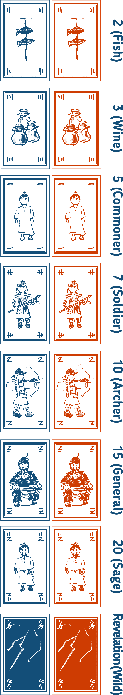
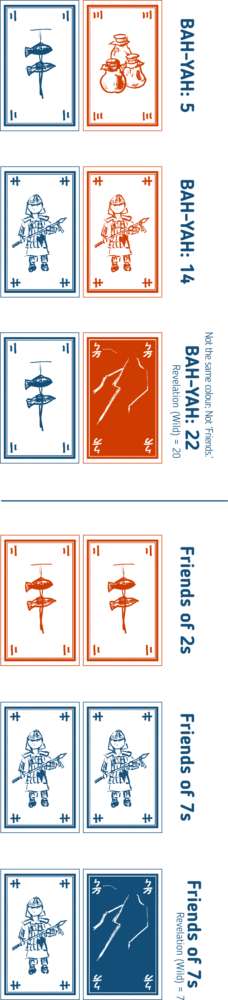
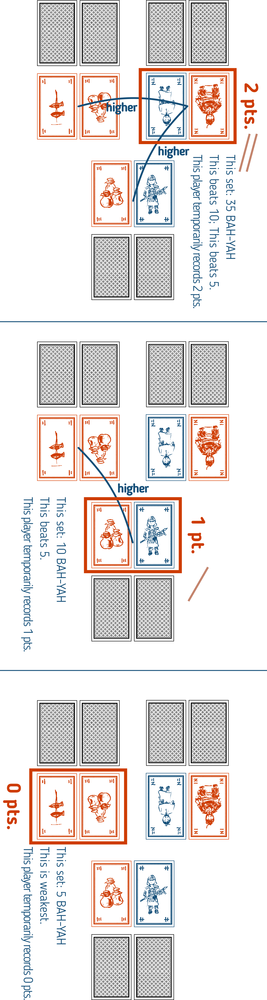

Our association sells this English translated version under **licence** from ‘Wooden Games by Mr. Tark’.* 我等人等受衣足々木遊術之認使七巫言筆此銭行。

Players take on the role of sages from a proverb, ‘Big things are far, small things are near’, and assist the King. Using their hand of cards, they will create two sets: a **‘Big and Far’** set and a **‘Small and Near’** set. They will pit their ‘Big and Far’ sets and ‘Small and Near’ sets against each other; the player who has collected the most money by the end of the game wins.

# Contents

- **1 Rulebook**
- **32 Cards** (7 Ranks & 1 Wild Card in 2 **colours**, 2 copies each) Backs: interconnected green rings. Faces: people and objects.

- **2 End Condition Summary Cards** (2-3P / 4-5P)
- **1 The Luminous Dragon Egg**
- **12 Sage’s Bracelets**
- **35 Counting Sticks**
- **50 Banknotes (currency unit: ZOO)** (1 [10], 2 [15], 5 [15], 10 [10])

# Game Flow

## Game End Condition

The game ends when one or more players have acquired the following amount of money:

- **2 Players:** 3 ZOO
- **3 Players:** 15 ZOO
- **4 Players:** 20 ZOO
- **5 Players:** 30 ZOO

## Game Start

Shuffle all cards to create a deck. All players draw **five cards** to form their hand.

## Set Creation

Create **two sets** from your hand. **Each set must consist of two cards.** The **stronger set is ‘the Far’,** and the **weaker set is ‘the Near’.** They can be of equal strength. The remaining card can be kept for the next round. All players place their two sets face-down on the table.

**Set Strength** is determined as follows: There are **‘Friends’** and **‘BAH-YAH’.** ‘Friends’ are two cards of the **same colour and the same number**; a Friends set is stronger than all BAH-YAH sets. This is because friends share a heartfelt bond! The strength between Friends sets is determined by their total value. A ‘BAH-YAH’ is any set that is not Friends. The strength between BAH-YAH sets is determined by their total value.

The **‘Revelation’** is a **wild card that can only be used with its matching colour**. Regardless of the player’s wishes, it is always treated as the card that gives the set its maximum possible strength.

## Scoring

All players reveal their strong set to determine the **‘Strong Set Score’.** As shown in the diagram, a set’s score is **the number of other players’ sets that are weaker than or equal to it.**

Use Counting Sticks to temporarily record this. Similarly, all players reveal their weak sets and temporarily record the score. A player’s earnings for the round are their **Strong Set Score multiplied by their Weak Set Score.**

## Hand Resolution

Keep the one unused card from your hand. Place the four used cards into a discard pile. Gather the discard pile and the deck, shuffle them, and create a new deck.

Afterward, all players draw **four additional cards** from the deck. In the rare case a player has six or more cards in hand, they must discard cards of their choice until they have five.

Repeat these rounds (Set Creation → Scoring → Hand Resolution). The game ends if any player has met the end condition amount.

# Sage’s Bracelet

During Scoring, any player who earned zero ZOO gains one **Sage’s Bracelet** token. This is because a sage reflects on and learns from the past! A player may discard a Bracelet token at any time. **For each Bracelet discarded, draw one card** from the deck. If you discard multiple Bracelets, draw that many cards.

# The Luminous Dragon Egg

A player whose **‘the Far’ and ‘the Near’ sets are *both* ‘Friends’** gains **The Luminous Dragon Egg**. This is because a good king must value their friends! If another player has the Egg, you **take it from them**.

The holder may discard the Egg after Set Creation (before reveal) to ‘read’ the minds of other players. Declare **‘the Far’ or ‘the Near’,** and all other players must reveal that declared set. After seeing the cards, the user takes back their two sets and performs Set Creation again. If multiple players qualify in the same round, the player with the stronger **‘the Near’ set** gains it. If still tied, the Egg does not move.

# Special Cases

If the game drags on and there is no way to deal cards or award Bracelets (e.g., the deck and discards run out), the game ends immediately. The player with the most ZOO at this time wins. This is because when people stop coming and going, or when too much reflection builds up, the sages become stressed. This is a sign of the kingdom’s collapse, but the wealthy should still be healthy!

‘The Luminous Dragon Egg’ is a game by **Wooden Games by Mr. Tark.** Unauthorized manufacturing or sale is prohibited. Please gamble responsibly; avoid fighting and large wagers. (Note: This warning is retained from the original text. Comply with all local gambling laws.)

