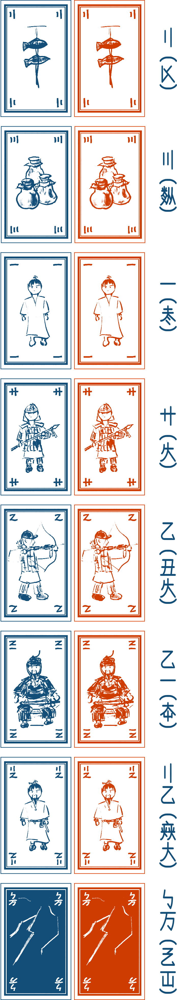

{height=100%}

当連盟は「タクさんの木製ゲーム」の許可のもとこれを和訳し、販売しています。我等人等受衣足々木遊術之認使言将言筆此銭行。

プレーヤーは「大きい物は遠く、小さい物は近い」という言い伝えに出てくる賢者として王さまを助けます。手札を使って、「大きくて遠い」と「小さくて近い」の二つのセットを作ります。「大きくて遠い」セット、「小さくて近い」セットそれぞれを戦わせていき、ゲーム終了時に最もお金を集めたプレーヤーの勝利です。

# 内容物

- **ルールブック** 一冊
- **カード** 三十二枚 (赤青各二枚。七ランクとワイルドカード) 裏は緑の輪が連なり、表は人や物に溢れています。

{height=100%}

- **終了条件サマリー** 二枚 (二人・三人用／四人・五人用)
- **光る龍の卵** 一つ  
- **賢者の腕輪** 十二個 
- **数え棒** 三十五本
- **お金** 五十枚 (一銭十枚、二銭十五枚、五銭 十五枚、十銭 十枚)

{height=100%}

# ゲーム進行

## ゲーム終了条件

一人以上のプレイヤーが下記の金額を獲得した際、ゲームが終了します。

- **二人** 三銭  
- **三人** 十五銭  
- **四人** 二十銭  
- **五人** 三十銭

## ゲーム開始時

全てのカードを混ぜて山札を作ります。全プレイヤーは**五枚のカード**を取って手札とします。

## セット作成

手札を使って**二つのセット**を作ります。**一つのセットは二枚**です。**強いセットが「大きくて遠い」**、**弱いセットが「小さくて近い」**です。同じ強さでも構いません。残ったカードは次のラウンドで使うことができます。全員が二つのセットを机に伏せて置きます。

{height=100%}

**セットの強さ**は以下の通りです。
セットには**「友だち」**と**「バーヤー」**があります。**友だちは同じ色でかつ、同じ数字の二枚**です。友だちは全てのバーヤーより強いです。※これは友だちには心の絆があるからです！　友だち同士の強弱は合計値で決定します。バーヤーとは、友だちでないセットです。バーヤー同士の強弱は合計値で決定します。

「天啓」は**同色にのみ使うことができるワイルドカード**で、プレイヤーの意思に関係なく、そのセットが最大限の強さになるようなカードとみなします。

{height=100%}

## 精算

全員が強いセットを公開して**「強いセットの点数」**を決定します。図のように、あるセットの点数は**そのセットより弱い、あるいは同じセットの個数**です。

{height=100%}

数え棒を使ってこれを一時的に記録します。同様に全プレイヤーが弱いセットを公開し点数を一時記録します。ある人の獲得額は**強いセットの点と弱いセットの点を掛け算**した額です。

## 手札処理

使わなかった一枚を残し、使用されたカードを捨て札にします。捨て札と山札を集めてシャッフルし、新たに山札を作ります。

その後、全プレイヤーは**四枚追加**で（山札から）獲得します。まれに手札が六枚以上になりますが、その際はカードを好きに捨て札にして手札が五枚になるようにします。

セット作成→精算→手札処理からなるラウンドを繰り返します。先述の金額を獲得しているプレイヤーがいればゲームが終了します。

# 賢者の腕輪

精算時、獲得額が零点のプレイヤーは賢者の腕輪トークンを一つ得ます。※これは賢者は過去を反省しそれに学ぶからです！　プレイヤーはいつでも使いたいときに腕輪トークンを捨てます。**腕輪一つを捨てるごとに山札一枚**を引きます。腕輪を複数捨てた場合はその数だけ山札を引きます。

# 光る龍の卵

**強いセットと弱いセットがともに「友だち」のプレイヤー**は光る龍の卵を獲得します。※これは良い王というのは友だちを重んじるはずだからです！　**他プレイヤーが卵を持っている場合はそれを獲得**します。セット作成の後プレイヤーが卵を捨てた場合、他人の心を読むことができます。このとき、プレイヤーは**強弱どちらかを宣言**します。そうすると**他プレイヤーの全ての強いセットか弱いセットが公開**されます。

その後、プレイヤーは出したセットを全て戻して再びセット作成を行います。強弱セットがともに「友だち」のプレイヤーが複数いる場合は弱いセットがより強いプレイヤーが卵を獲得します。弱いセットも同じ場合卵は移動しません。

# 特殊なケース

ゲームが長引きすぎて手札や腕輪を与える手段がない場合、ゲームは終了します。この時点で最もお金を集めたプレイヤーが勝利します。※これは人が行き来しなくなったり、反省が募りすぎたりすると賢者がストレスを受けるためです。これは国の崩壊の兆候ですが、富めるものは健康であるはずだからです！

{height=100%}

このゲーム「光る龍の卵」は**タクさんの木製ゲーム**が製作したものです。我々の許可なく作製して販売することを禁じます。
賭博をする際は喧嘩をせず、多くの金額を賭けないでください。（原文ママ。日本では賭博は刑罰の対象です。）
